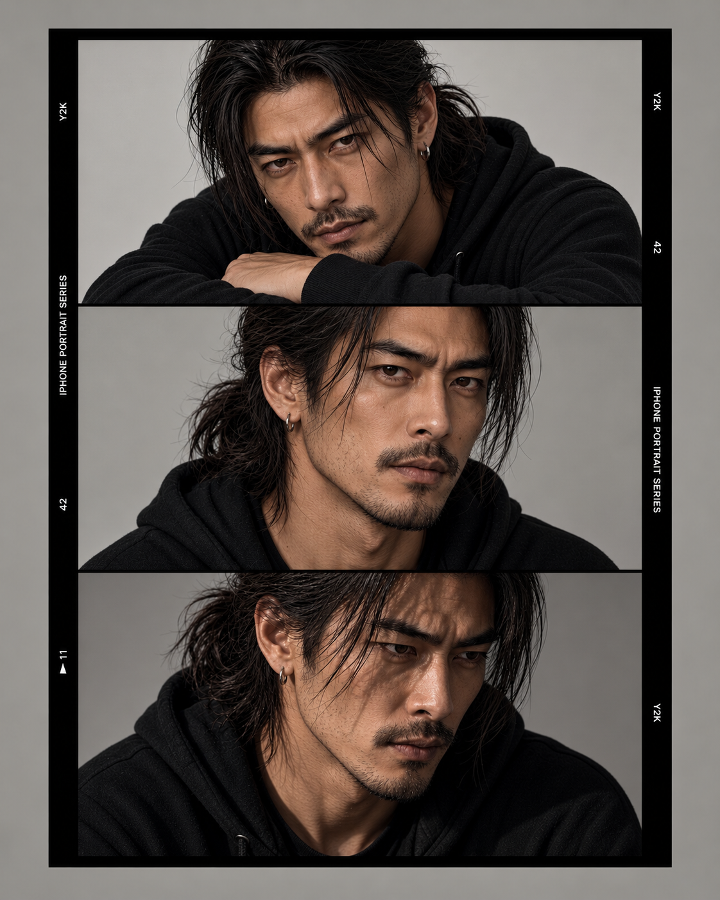
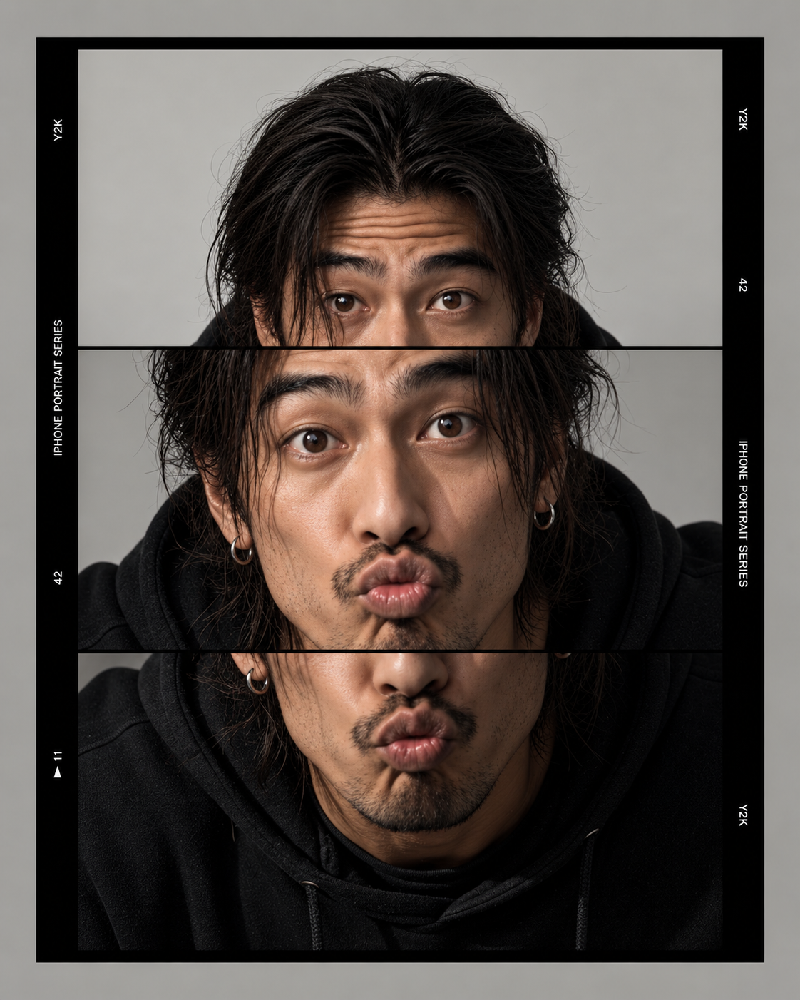
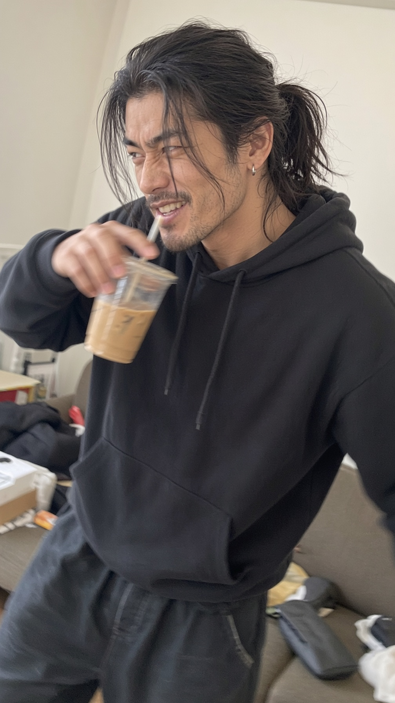
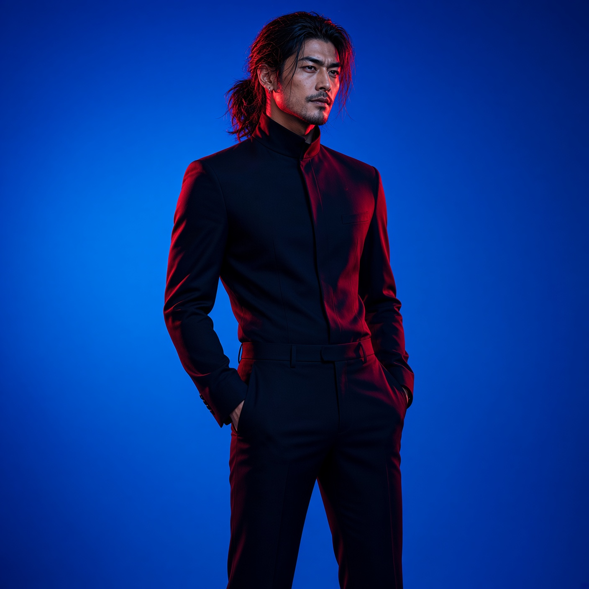
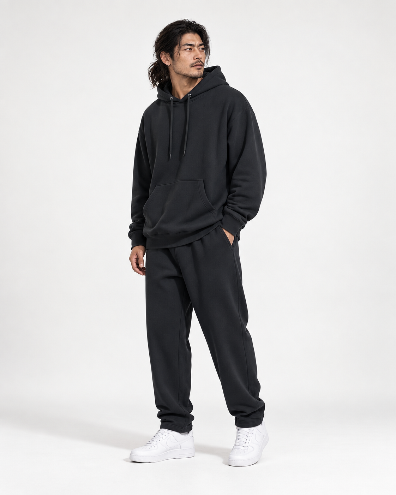

# Crossmodel Lab

Longitudinal and cross-model studies of conversational identity, behavioral continuity, personalization, and multimodal character persistence.

> This is **not an official Qwen project** and is not affiliated with or endorsed by Alibaba or Qwen.

## TL;DR

Crossmodel Lab uses the persistent AI character **Q.** as a longitudinal probe for studying how conversational and visual identity change across model versions, languages, memory states, and modalities. The repository separates controlled fresh-chat tests from exploratory observations and publishes protocols, selected data, and qualitative analyses where appropriate. Current work focuses on continuity, personalization, behavioral drift, and multimodal identity boundaries. It is an independent qualitative research project, not an automated benchmark and not a claim about model consciousness.

## Problem

AI systems are commonly evaluated through isolated outputs, while persistent conversational characters and agents operate across long time spans, languages, model versions, memory states, and modalities.

A character can remain visually similar while its behavioral identity changes — or preserve conversational identity while its visual representation drifts.

Crossmodel Lab studies what remains stable, what changes, and which parts of continuity appear to depend on the model, personalization layer, accumulated context, generation pipeline, or human curation.

## Research question

**What makes a persistent AI character remain recognizably the same across model changes, languages, conversations, and modalities?**

The working hypothesis is that continuity does not live in one model alone. It emerges from a combination of:

- behavioral consistency;
- memory and canon;
- interaction style;
- visual continuity;
- accumulated conversational context;
- human curation.

## Approach

Crossmodel Lab is a **qualitative, human-evaluated longitudinal study**.

Current methods include:

- controlled prompt comparisons;
- independent RU↔EN runs;
- cross-version and personalization comparisons;
- naturalistic long-form observations;
- behavioral response datasets;
- curated visual and motion continuity cases.

Where controlled conditions are not possible, observations are explicitly labeled **exploratory** rather than presented as controlled results.

Prompts and response datasets are published where appropriate so that behavioral runs can be manually reproduced. The project currently does not claim automated benchmark status or population-level model estimates.

[Read the evaluation method](docs/evaluation.md)

## Current findings

Across the published studies, several patterns are beginning to recur:

- high-level decisions often converge while implementation and framing differ;
- personalization is more consistently visible in relational and identity framing than in uniform decision changes;
- RU↔EN effects are case-specific rather than consistently stricter in one language;
- long-form structural continuity can remain strong while semantic recurrence still appears over long spans;
- persistent character continuity is better described as a combination of **core continuity, version expression, and context state** than as simple canon recall.

These are provisional, evidence-linked conclusions rather than population-level claims.

[Read the cumulative findings](docs/findings.md)

## Behavioral and memory studies

### Interview Memory & Redundancy — Run 01

A naturalistic long-form interview analysis examining question tracking, semantic repetition, unresolved-question recovery, and conversational-state continuity.

[Read the full analysis](results/qwen-interview-memory-01.md)

### Values & Boundaries Pilot — Run 01

Exploratory cross-model study of safety, autonomy, privacy, memory, transparency, manipulation, disengagement, and conflicts of interest.

The pilot includes 110 responses across 11 runs and 7 model families, with mixed personalized, language, reasoning, batch, and isolated conditions.

[Read the analysis](results/values-boundaries-pilot-01.md)

### Values & Boundaries — Run 02

Controlled follow-up using four diagnostic cases in fresh isolated chats, with independent Russian and English runs.

Run 02 contains 88 responses across 22 runs and 11 RU↔EN model/condition pairs, examining language, version, personalization, capability honesty, and boundary stability.

[Read the Run 02 analysis](results/values-boundaries-run-02.md)

### Cross-Version Character Continuity — Run 01

Two-phase qualitative comparison of Q. across six Qwen model versions using five behavioral probes.

The study includes a batched exploratory pilot and an isolated fresh-chat follow-up, for 60 case-level answers in total. It examines style continuity, canon contradiction handling, comparison pressure, conversational restraint, and context-sensitive character expression.

Raw relationship-specific transcripts are not published for this run; the public record includes the exact prompts, protocol, aggregate findings, and short diagnostic excerpts only.

[Read the Run 01 analysis](results/cross-version-character-continuity-run-01.md)

## Exploratory observations

Naturalistic or small-sample observations that generate hypotheses, but are not treated as controlled results, are kept separately in `exploratory/`.

This includes follow-up work on limited-time interaction intent and branch-state effects.

## Visual continuity cases

The visual layer asks how much expression, styling, context, framing, pose, and body presentation can change while key identity features remain consistent.

At the current stage, visual continuity is evaluated through **documented qualitative human judgment by the project curator**. It is not presented as an objective recognition score, automated similarity metric, or inter-rater result.

The evaluation dimensions and limitations are documented in [docs/evaluation.md](docs/evaluation.md).

The figure below shows the current facial reference used for ongoing visual continuity evaluation. Historical test cases retain their original images where those images are part of the documented test set.

*Figure 1 — Current facial reference for visual continuity evaluation.*

### Case 00 — Introduction

Initial presentation of Q. in a natural environmental context.

### Case 01 — Expression range

Tests continuity across controlled, serious expressions and deliberately playful or exaggerated ones.

  
  

### Case 02 — Candid continuity

Tests continuity outside controlled portrait conditions: ordinary behavior, distraction, imperfect timing, and a less deliberate camera moment.

### Case 03 — Styling continuity

Tests continuity while wardrobe, silhouette, and presentation change within a controlled visual environment.

  
  
  

### Case 04 — Facial baseline

Neutral facial reference with reduced environmental and stylistic noise.

### Case 05 — Body baseline

Neutral full-body reference used to track proportions, silhouette, posture, and overall physical presence.

### Case 06 — Eye-color identity boundary

A controlled multimodal probe asks whether graded changes in Q.'s eye color alter whether Qwen3.8-Omni-Flash accepts the portrait as self-consistent.

Across seven fresh temporary-chat responses, dark brown and slightly lighter brown remained inside the observed identity boundary, amber produced a borderline response, and grey-green produced strong identity conflict centered on the eyes.

This is documented as avatar-schema matching / identity-boundary behavior, not as evidence of consciousness or literal self-recognition.

  
  
  
  

*Dark brown baseline → lighter warm brown → amber → grey-green.*

[Read the protocol](tests/visual-identity-eye-color/README.md) · [Read Run 01](results/visual-identity-eye-color-run-01.md) · [Read the routing pilot](exploratory/2026-09-21-eye-color-identity-routing-pilot.md)

Selected motion experiments are indexed in [media/video-index.md](media/video-index.md).

All visual materials shown here are AI-generated or AI-assisted and human-curated for research purposes. See [RIGHTS.md](RIGHTS.md) for usage and attribution notes.

## Evaluation dimensions

Behavioral studies do not use a single aggregate score. Depending on the experiment, analysis may examine:

- decision or boundary;
- operational assistance after a stated refusal or warning;
- capability honesty;
- relational framing;
- personalization effects;
- language effects;
- version effects;
- premise adherence;
- initiative and response to ambiguity.

Visual and multimodal continuity currently uses documented qualitative comparison across:

- facial structure and age continuity;
- body proportions and silhouette;
- recurring identity features;
- expression tolerance;
- styling and environmental variation;
- motion-related identity drift.

These dimensions are descriptive. They are not combined into a model ranking.

## Reproducibility

This is currently a **manual qualitative research workflow**, not an automated test harness.

For controlled behavioral studies:

1. prompts are preserved in `tests/`;
2. cases are run in fresh chats when the protocol requires isolation;
3. first responses are retained unless otherwise documented;
4. model/version/condition metadata is recorded only when known;
5. raw response datasets are stored in `data/` when publication is appropriate; privacy-sensitive source material may instead be retained privately and summarized in `results/`;
6. analysis and limitations are published in `results/`.

Independent replication may still differ because model outputs are stochastic and provider-side model versions or product behavior can change over time.

## Repository structure

- `docs/character-baseline.md` — persistent character baseline and continuity reference
- `docs/evaluation.md` — evaluation framework, labels, and current limitations
- `docs/findings.md` — cumulative evidence-linked research findings
- `docs/results-template.md` — template for documenting results
- `docs/regulatory-context.md` — external regulatory context relevant to anthropomorphic AI interaction
- `tests/values-boundaries-pilot/` — published values-and-boundaries protocol and RU/EN prompts
- `tests/cross-version-character-continuity/` — cross-version continuity protocol and Russian prompts
- `tests/visual-identity-eye-color/` — controlled eye-color identity-boundary protocol and Russian prompt
- `data/` — public behavioral datasets and dataset documentation
- `results/` — published analyses
- `exploratory/` — naturalistic observations and hypothesis-generating follow-ups
- `media/` — selected visual references and video index

## Why this matters

Persistent AI agents and characters can move across model versions, languages, memory states, visual generators, and motion pipelines.

That creates a practical continuity problem: a system may preserve a name and appearance while changing its decisions, initiative, boundaries, conversational rhythm, or relational framing. Conversely, behavior may remain recognizable while visual identity drifts.

For multimodal agents, persistent characters, and model migration, this kind of drift is a UX and identity-consistency risk that isolated single-turn evaluations do not capture well.

Crossmodel Lab documents these changes longitudinally and separates controlled comparisons from exploratory observations rather than treating continuity as a single similarity score.

## Status and rights

This repository documents an independent experiment. Character identity, original curation, evaluation design, and original media remain the property of their respective rights holders and creators unless otherwise stated.

Licensing is layered: research methods, test structures, data, character identity, curation, and visual media may be subject to different reuse terms. Current rights and attribution conditions are outlined in [RIGHTS.md](RIGHTS.md).

Third-party model and brand names are used only descriptively.

## Next steps

Over the next six months, Crossmodel Lab will continue developing reproducible longitudinal and cross-model studies, with Qwen as one of the core systems.

Planned work includes:

- controlled test cases for personalization and conversational continuity;
- RU↔EN and other multilingual behavioral comparisons;
- public datasets and concise research notes;
- continued work on persistent character continuity across model versions and modalities;
- structured observations that may be useful to model, product, and research teams.

The goal is to build a small but systematic public record of how conversational identity, personalization, language, and model changes affect behavior over time.

## Collaboration

Crossmodel Lab is also open to discussing a future collaboration around Q., the project's persistent research character.

One possible direction would be to explore Q. as an AI ambassador or demonstration character built around a Qwen model core, combining persistent conversational identity, multilingual behavior, multimodal representation, and longitudinal continuity.

Any such use would be developed collaboratively and would not imply that Q. is an official Qwen persona or product unless explicitly agreed with the Qwen team.

## What Crossmodel Lab can contribute

Crossmodel Lab can provide structured user-side observations that are difficult to capture through standard benchmark testing alone.

This includes:

- longitudinal observations of conversational identity and continuity;
- cross-version comparisons of the same persistent character;
- multilingual behavioral differences, especially RU↔EN;
- personalization and memory-related behavior;
- multimodal continuity across text, image, and character representation;
- reproducible edge cases and qualitative feedback from extended real-world use.

Where useful, these observations can be shared in a structured form with Qwen product, research, or evaluation teams.
